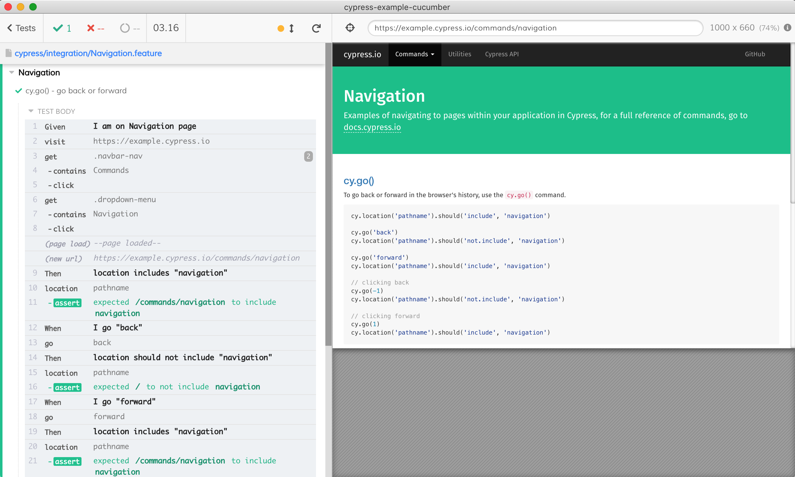

# Cypress + Cucumber example

Following [cypress-cucumber-preprocessor](https://github.com/TheBrainFamily/cypress-cucumber-preprocessor) docs and [Integrating Cypress with Cucumber and Gherkin](https://wanago.io/2020/01/13/javascript-testing-cypress-cucumber/)

See [cypress/integration/Navigation.feature](cypress/integration/Navigation.feature) and step implementation in [cypress/integration/Navigation/Navigation.js](cypress/integration/Navigation/Navigation.js).

